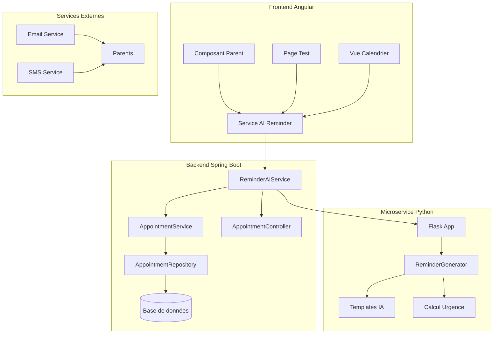

# 🤖 Documentation Complète - Système de Rappels IA NeuroCare

## 📋 Table des Matières

1. [Vue d'ensemble](#vue-densemble)
2. [Architecture du Système](#architecture-du-système)
3. [Microservice Python Flask](#microservice-python-flask)
4. [Backend Spring Boot](#backend-spring-boot)
5. [Frontend Angular](#frontend-angular)
6. [API Documentation](#api-documentation)
7. [Installation et Configuration](#installation-et-configuration)
8. [Tests et Validation](#tests-et-validation)
9. [Dépannage](#dépannage)
10. [Sécurité](#sécurité)
11. [Performance](#performance)
12. [Maintenance](#maintenance)

---

## 🎯 Vue d'ensemble

Le **Système de Rappels IA NeuroCare** est une solution complète de génération automatique de rappels personnalisés pour les rendez-vous médicaux et thérapeutiques. Le système utilise l'intelligence artificielle pour créer des messages adaptés, contextuels et urgents selon le type et la proximité des rendez-vous.

### 🎯 Objectifs
- **Personnalisation** : Messages adaptés à chaque type de rendez-vous
- **Urgence intelligente** : Classification automatique des niveaux d'urgence
- **Scalabilité** : Traitement en lot de multiples rappels
- **Fiabilité** : Système de fallback en cas d'indisponibilité
- **Intégration** : Interface transparente avec l'écosystème NeuroCare

### 🏗️ Composants Principaux
1. **Microservice Python Flask** : Génération IA des rappels
2. **Backend Spring Boot** : API REST et logique métier
3. **Frontend Angular** : Interface utilisateur parent
4. **Base de données** : Stockage des rendez-vous et statuts

---

## 🏛️ Architecture du Système



### 🔄 Flux de Données

1. **Génération Individuelle** :
   ```
   Parent → Angular → Spring Boot → Python Flask → IA → Rappel → Parent
   ```

2. **Génération en Lot** :
   ```
   Parent → Angular → Spring Boot → Python Flask → IA → Batch → Parent
   ```

3. **Tâche Planifiée** :
   ```
   Cron → Spring Boot → Python Flask → IA → Rappels → Parents
   ```

---

## 🐍 Microservice Python Flask

### 📁 Structure du Projet

```
ai-reminder-service/
├── app.py                 # Application Flask principale
├── config.py             # Configuration et templates
├── requirements.txt       # Dépendances Python
├── start.sh              # Script de démarrage Linux/Mac
├── start.bat             # Script de démarrage Windows
├── test_service.py       # Tests du service
└── README.md             # Documentation du service
```

### 🔧 Configuration

#### `config.py`
```python
# Templates de rappels par type
REMINDER_TEMPLATES = {
    'CONSULTATION': {
        'urgent': "🚨 URGENT: Consultation médicale pour {child_name} dans 2h avec {professional_name}",
        'today': "📅 Aujourd'hui: Consultation avec {professional_name} à {appointment_time}",
        'tomorrow': "⏰ Demain: Consultation médicale prévue à {appointment_time}",
        'upcoming': "📋 Rappel: Consultation avec {professional_name} le {appointment_time}"
    }
}

# Seuils d'urgence
URGENCY_THRESHOLDS = {
    'URGENT': 2,      # heures
    'TODAY': 24,      # heures
    'TOMORROW': 48,   # heures
    'UPCOMING': 168   # heures (7 jours)
}
```

#### `requirements.txt`
```
flask==3.0.0
flask-cors==4.0.0
python-dateutil==2.8.2
marshmallow==3.20.1
colorlog==6.8.0
requests==2.31.0
pytest==7.4.3
pytest-flask==1.3.0
```

### 🚀 Endpoints API

#### 1. Health Check
```http
GET /health
```
**Réponse :**
```json
{
  "status": "healthy",
  "service": "AI Reminder Service",
  "version": "1.0.0",
  "timestamp": "2024-12-19T10:30:00Z",
  "uptime": "2h 15m 30s",
  "endpoints": ["/health", "/generate-reminder", "/batch-reminders", "/templates"]
}
```

#### 2. Génération de Rappel Unique
```http
POST /generate-reminder
Content-Type: application/json

{
  "childName": "Alice",
  "professionalName": "Dr. Martin",
  "appointmentTime": "2024-12-20T14:30:00",
  "location": "Cabinet médical",
  "appointmentType": "CONSULTATION",
  "notes": "Apporter le carnet de santé"
}
```

**Réponse :**
```json
{
  "success": true,
  "message": "🔔 Rappel: Consultation médicale pour Alice avec Dr. Martin le 20/12/2024 à 14:30. Lieu: Cabinet médical. N'oubliez pas d'apporter le carnet de santé.",
  "urgency": "UPCOMING",
  "urgency_icon": "📋",
  "urgency_color": "#0d6efd",
  "appointment_type": "CONSULTATION",
  "child_name": "Alice",
  "professional_name": "Dr. Martin",
  "appointment_time": "2024-12-20T14:30:00",
  "location": "Cabinet médical",
  "notes": "Apporter le carnet de santé",
  "generated_at": "2024-12-19T10:30:00Z",
  "source": "ai_service",
  "version": "1.0.0"
}
```

#### 3. Génération en Lot
```http
POST /batch-reminders
Content-Type: application/json

{
  "appointments": [
    {
      "childName": "Alice",
      "professionalName": "Dr. Martin",
      "appointmentTime": "2024-12-20T14:30:00",
      "location": "Cabinet médical",
      "appointmentType": "CONSULTATION",
      "notes": "Apporter le carnet de santé"
    }
  ]
}
```

**Réponse :**
```json
{
  "success": true,
  "count": 1,
  "total_requested": 1,
  "errors_count": 0,
  "reminders": [
    {
      "message": "🔔 Rappel: Consultation médicale...",
      "urgency": "UPCOMING",
      "generated_at": "2024-12-19T10:30:00Z"
    }
  ],
  "errors": [],
  "generated_at": "2024-12-19T10:30:00Z",
  "source": "ai_service"
}
```

### 🧠 Logique IA

#### Calcul d'Urgence
```python
def calculate_urgency(appointment_time: str) -> str:
    now = datetime.now()
    appointment = datetime.fromisoformat(appointment_time.replace('Z', '+00:00'))
    time_diff = (appointment - now).total_seconds() / 3600  # heures
    
    if time_diff <= URGENCY_THRESHOLDS['URGENT']:
        return 'URGENT'
    elif time_diff <= URGENCY_THRESHOLDS['TODAY']:
        return 'TODAY'
    elif time_diff <= URGENCY_THRESHOLDS['TOMORROW']:
        return 'TOMORROW'
    else:
        return 'UPCOMING'
```

#### Génération de Message
```python
def generate_reminder_message(request: ReminderRequest) -> str:
    urgency = calculate_urgency(request.appointment_time)
    template = get_template(request.appointment_type, urgency)
    
    return template.format(
        child_name=request.childName,
        professional_name=request.professionalName,
        appointment_time=format_appointment_time(request.appointment_time),
        location=request.location or "lieu non spécifié",
        notes=request.notes or ""
    )
```

---

## ☕ Backend Spring Boot

### 📁 Structure du Projet

```
src/main/java/com/BrainStack/
├── Services/
│   ├── ReminderAIService.java      # Service principal IA
│   └── AppointmentService.java     # Service rendez-vous (modifié)
├── Controller/
│   ├── AIReminderController.java   # Controller IA
│   └── AppointmentController.java  # Controller rendez-vous (modifié)
├── Dto/
│   ├── AIReminderRequest.java      # DTO requête IA
│   └── AIReminderResponse.java     # DTO réponse IA
└── Entity/
    └── Appointment.java            # Entité rendez-vous
```

### 🔧 Configuration

#### `application.properties`
```properties
# Configuration IA
ai.service.url=http://localhost:5000
ai.service.timeout=5000

# Base de données
spring.datasource.url=jdbc:mysql://localhost:3306/neurocare
spring.datasource.username=root
spring.datasource.password=password

# Logging
logging.level.com.BrainStack.Services.ReminderAIService=INFO
logging.level.com.BrainStack.Controller.AIReminderController=INFO
```

#### `pom.xml` (Dépendances ajoutées)
```xml
<dependencies>
    <!-- Spring Boot Web -->
    <dependency>
        <groupId>org.springframework.boot</groupId>
        <artifactId>spring-boot-starter-web</artifactId>
    </dependency>
    
    <!-- Spring Boot JPA -->
    <dependency>
        <groupId>org.springframework.boot</groupId>
        <artifactId>spring-boot-starter-data-jpa</artifactId>
    </dependency>
    
    <!-- Spring Boot Scheduling -->
    <dependency>
        <groupId>org.springframework.boot</groupId>
        <artifactId>spring-boot-starter-quartz</artifactId>
    </dependency>
    
    <!-- Validation -->
    <dependency>
        <groupId>org.springframework.boot</groupId>
        <artifactId>spring-boot-starter-validation</artifactId>
    </dependency>
</dependencies>
```

### 🚀 Services Principaux

#### `ReminderAIService.java`
```java
@Service
public class ReminderAIService {
    
    @Value("${ai.service.url:http://localhost:5000}")
    private String aiServiceUrl;
    
    @Autowired
    private RestTemplate restTemplate;
    
    /**
     * Vérifie la disponibilité du microservice Python
     */
    public boolean isAIServiceAvailable() {
        try {
            String url = aiServiceUrl + "/health";
            ResponseEntity<Map> response = restTemplate.getForEntity(url, Map.class);
            return response.getStatusCode().is2xxSuccessful() 
                && "healthy".equals(response.getBody().get("status"));
        } catch (Exception e) {
            log.warn("❌ Microservice IA Rappels indisponible: {}", e.getMessage());
            return false;
        }
    }
    
    /**
     * Génère un rappel unique
     */
    public AIReminderResponse generateReminderForAppointment(Appointment appointment) {
        if (!isAIServiceAvailable()) {
            return generateFallbackReminder(appointment);
        }
        
        try {
            String url = aiServiceUrl + "/generate-reminder";
            AIReminderRequest request = convertAppointmentToAIReminderRequest(appointment);
            
            HttpHeaders headers = new HttpHeaders();
            headers.setContentType(MediaType.APPLICATION_JSON);
            HttpEntity<AIReminderRequest> entity = new HttpEntity<>(request, headers);
            
            ResponseEntity<AIReminderResponse> response = restTemplate.postForEntity(
                url, entity, AIReminderResponse.class);
            
            if (response.getStatusCode().is2xxSuccessful() && response.getBody() != null) {
                return response.getBody();
            } else {
                return generateFallbackReminder(appointment);
            }
        } catch (Exception e) {
            log.error("❌ Erreur génération rappel IA: {}", e.getMessage());
            return generateFallbackReminder(appointment);
        }
    }
}
```

#### `AppointmentService.java` (Méthodes ajoutées)
```java
@Service
public class AppointmentService {
    
    @Autowired
    private ReminderAIService reminderAIService;
    
    /**
     * Génère un rappel pour un rendez-vous spécifique
     */
    public Map<String, Object> generateReminderForAppointment(Long appointmentId) {
        try {
            Appointment appointment = appointmentRepository.findById(appointmentId)
                .orElseThrow(() -> new ResourceNotFoundException("Rendez-vous non trouvé"));
            
            AIReminderResponse response = reminderAIService.generateReminderForAppointment(appointment);
            
            // Mise à jour du statut
            appointment.setNotificationSent(true);
            appointment.setReminderSentAt(LocalDateTime.now());
            appointmentRepository.save(appointment);
            
            return Map.of(
                "success", true,
                "appointment_id", appointmentId,
                "message", response.getMessage(),
                "generated_at", response.getGeneratedAt(),
                "source", "ai_service"
            );
        } catch (Exception e) {
            log.error("❌ Erreur génération rappel: {}", e.getMessage());
            return Map.of("success", false, "error", e.getMessage());
        }
    }
    
    /**
     * Tâche planifiée pour l'envoi automatique
     */
    @Scheduled(cron = "0 0 8 * * *") // Tous les jours à 8h00
    public void sendAutomaticReminders() {
        log.info("🔄 Démarrage envoi automatique des rappels");
        
        try {
            LocalDateTime now = LocalDateTime.now();
            LocalDateTime tomorrow = now.plusDays(1);
            LocalDateTime dayAfterTomorrow = now.plusDays(2);
            
            List<Appointment> upcomingAppointments = appointmentRepository
                .findAppointmentsBetween(tomorrow, dayAfterTomorrow)
                .stream()
                .filter(appointment -> !appointment.getNotificationSent())
                .collect(Collectors.toList());
            
            if (!upcomingAppointments.isEmpty()) {
                Map<String, Object> result = reminderAIService.generateBatchReminders(upcomingAppointments);
                
                // Mise à jour des statuts
                upcomingAppointments.forEach(appointment -> {
                    appointment.setNotificationSent(true);
                    appointment.setReminderSentAt(LocalDateTime.now());
                });
                appointmentRepository.saveAll(upcomingAppointments);
                
                log.info("✅ Rappels automatiques envoyés: {} rappels", result.get("count"));
            }
        } catch (Exception e) {
            log.error("❌ Erreur envoi automatique: {}", e.getMessage());
        }
    }
}
```

### 🚀 Endpoints API

#### 1. Health Check IA
```http
GET /api/v1/ai-reminders/health
```

#### 2. Génération de Rappel
```http
POST /api/v1/appointments/{id}/generate-reminder
```

#### 3. Prévisualisation
```http
GET /api/v1/appointments/{id}/preview-reminder
```

#### 4. Rappels Parent
```http
POST /api/v1/appointments/parent/{parentId}/generate-reminders
```

#### 5. Rappels Automatiques
```http
POST /api/v1/appointments/send-automatic-reminders
```

---

## 🅰️ Frontend Angular

### 📁 Structure du Projet

```
src/app/
├── services/
│   └── ai-reminder.service.ts      # Service Angular IA
├── features/appointments/
│   └── reminder-test/
│       ├── reminder-test.component.ts
│       ├── reminder-test.component.html
│       └── reminder-test.component.scss
└── parent/rdv/pages/
    ├── appointments-list/
    │   ├── appointments-list.component.ts (modifié)
    │   ├── appointments-list.component.html (modifié)
    │   └── appointments-list.component.scss (modifié)
    └── calendar-view/
        ├── calendar-view.component.ts (modifié)
        ├── calendar-view.component.html (modifié)
        └── calendar-view.component.scss (modifié)
```

### 🔧 Service Angular

#### `ai-reminder.service.ts`
```typescript
@Injectable({
  providedIn: 'root'
})
export class AIReminderService {
  
  private readonly apiUrl = 'http://localhost:8089/api/v1';
  private readonly aiServiceUrl = 'http://localhost:5000';
  
  constructor(private http: HttpClient) { }
  
  /**
   * Vérifie la santé du service IA
   */
  checkHealth(): Observable<HealthResponse> {
    return this.http.get<HealthResponse>(`${this.apiUrl}/ai-reminders/health`)
      .pipe(
        tap(response => console.log('✅ Service IA opérationnel:', response)),
        catchError(error => {
          console.error('❌ Service IA indisponible:', error);
          return throwError(() => error);
        })
      );
  }
  
  /**
   * Génère un rappel pour un rendez-vous
   */
  generateReminder(appointmentId: number): Observable<ReminderResponse> {
    return this.http.post<any>(`${this.apiUrl}/appointments/${appointmentId}/generate-reminder`, {})
      .pipe(
        map(response => response.data),
        tap(response => console.log('✅ Rappel généré:', response)),
        catchError(error => {
          console.error('❌ Erreur génération rappel:', error);
          return throwError(() => error);
        })
      );
  }
  
  /**
   * Génère des rappels pour tous les rendez-vous d'un parent
   */
  generateRemindersForParent(parentId: number): Observable<BatchReminderResponse> {
    return this.http.post<any>(`${this.apiUrl}/appointments/parent/${parentId}/generate-reminders`, {})
      .pipe(
        map(response => response.data),
        tap(response => console.log('✅ Rappels parent générés:', response)),
        catchError(error => {
          console.error('❌ Erreur génération rappels parent:', error);
          return throwError(() => error);
        })
      );
  }
}
```

### 🎨 Composants UI

#### Liste des Rendez-vous
```html
<!-- Bouton global -->
<button class="btn btn-success ms-2" (click)="generateAllReminders()" [disabled]="reminderLoading">
  <i class="fa-solid fa-bell me-2" *ngIf="!reminderLoading"></i>
  <i class="fa-solid fa-spinner fa-spin me-2" *ngIf="reminderLoading"></i>
  {{ reminderLoading ? 'Génération...' : 'Générer Rappels' }}
</button>

<!-- Boutons individuels -->
<td>
  <div class="btn-group" role="group">
    <button class="btn btn-sm btn-outline-primary" (click)="previewReminder(a.id)" [disabled]="reminderLoading">
      <i class="fa-solid fa-eye"></i>
    </button>
    <button class="btn btn-sm btn-primary" (click)="generateReminder(a.id)" [disabled]="reminderLoading">
      <i class="fa-solid fa-bell"></i>
    </button>
  </div>
</td>
```

#### Modal de Rappel
```html
<div class="modal fade" [class.show]="showReminderModal">
  <div class="modal-dialog modal-lg">
    <div class="modal-content">
      <div class="modal-header">
        <h5 class="modal-title">
          <i class="fa-solid fa-bell me-2"></i>Rappel Généré
        </h5>
      </div>
      <div class="modal-body" *ngIf="generatedReminder">
        <div class="reminder-card">
          <div class="reminder-header">
            <div class="urgency-badge" [ngClass]="getUrgencyClass(generatedReminder.urgency)">
              <span class="urgency-icon">{{ generatedReminder.urgency_icon }}</span>
              <span class="urgency-text">{{ generatedReminder.urgency }}</span>
            </div>
          </div>
          <div class="reminder-content">
            <p class="reminder-message">{{ generatedReminder.message }}</p>
          </div>
        </div>
      </div>
    </div>
  </div>
</div>
```

---

## 📚 API Documentation

### 🔗 Endpoints Principaux

| Méthode | Endpoint | Description | Paramètres |
|---------|----------|-------------|------------|
| `GET` | `/health` | Santé du service | - |
| `POST` | `/generate-reminder` | Rappel unique | `ReminderRequest` |
| `POST` | `/batch-reminders` | Rappels en lot | `BatchReminderRequest` |
| `GET` | `/templates` | Templates disponibles | - |

### 📝 Modèles de Données

#### `ReminderRequest`
```typescript
interface ReminderRequest {
  childName: string;
  professionalName: string;
  startTime: string;
  type: 'CONSULTATION' | 'THERAPEUTIC' | 'MEDICAL' | 'EDUCATIONAL';
  location?: string;
  notes?: string;
}
```

#### `ReminderResponse`
```typescript
interface ReminderResponse {
  success: boolean;
  message: string;
  urgency: 'URGENT' | 'TODAY' | 'TOMORROW' | 'UPCOMING';
  urgency_icon: string;
  urgency_color: string;
  appointment_type: string;
  child_name: string;
  professional_name: string;
  appointment_time: string;
  location: string;
  notes: string;
  generated_at: string;
  source: string;
  version: string;
}
```

---

## 🚀 Installation et Configuration

### 1. Prérequis

#### Système
- **Python 3.8+**
- **Java 17+**
- **Node.js 18+**
- **MySQL 8.0+**

#### Outils
- **Maven 3.6+**
- **Angular CLI 17+**
- **Git**

### 2. Installation Microservice Python

```bash
# Cloner le projet
cd ai-reminder-service

# Créer environnement virtuel
python -m venv venv
source venv/bin/activate  # Linux/Mac
# ou
venv\Scripts\activate     # Windows

# Installer dépendances
pip install -r requirements.txt

# Démarrer le service
python app.py
```

### 3. Installation Backend Spring Boot

```bash
# Cloner le projet
cd NeuroCare-Backend

# Compiler et démarrer
./mvnw spring-boot:run
# ou
mvn spring-boot:run
```

### 4. Installation Frontend Angular

```bash
# Cloner le projet
cd NeuroCare_Front

# Installer dépendances
npm install

# Démarrer le serveur
ng serve
```

### 5. Scripts de Démarrage

#### Windows (`start-all.bat`)
```batch
@echo off
echo Démarrage du système de rappels IA...

echo 🐍 Démarrage microservice Python...
start "Python Service" cmd /k "cd ai-reminder-service && python app.py"

echo ☕ Démarrage backend Spring Boot...
start "Spring Boot" cmd /k "cd NeuroCare-Backend && mvn spring-boot:run"

echo 🅰️ Démarrage frontend Angular...
start "Angular" cmd /k "cd NeuroCare_Front && ng serve"

echo ✅ Tous les services sont en cours de démarrage...
```

#### Linux/Mac (`start-all.sh`)
```bash
#!/bin/bash
echo "Démarrage du système de rappels IA..."

echo "🐍 Démarrage microservice Python..."
cd ai-reminder-service && python app.py &
PYTHON_PID=$!

echo "☕ Démarrage backend Spring Boot..."
cd ../NeuroCare-Backend && ./mvnw spring-boot:run &
SPRING_PID=$!

echo "🅰️ Démarrage frontend Angular..."
cd ../NeuroCare_Front && ng serve &
ANGULAR_PID=$!

echo "✅ Tous les services sont démarrés"
echo "Python PID: $PYTHON_PID"
echo "Spring PID: $SPRING_PID"
echo "Angular PID: $ANGULAR_PID"
```

---

## 🧪 Tests et Validation

### 1. Tests Python

```bash
cd ai-reminder-service
python test_service.py
```

**Tests inclus :**
- ✅ Health check
- ✅ Génération rappel unique
- ✅ Génération en lot
- ✅ Templates disponibles
- ✅ Gestion d'erreurs
- ✅ Niveaux d'urgence

### 2. Tests Backend

```bash
cd NeuroCare-Backend
./mvnw test
```

**Tests inclus :**
- ✅ Service ReminderAIService
- ✅ Controller AIReminderController
- ✅ Intégration avec AppointmentService
- ✅ Tâches planifiées

### 3. Tests Frontend

```bash
cd NeuroCare_Front
ng test
```

**Tests inclus :**
- ✅ Service AIReminderService
- ✅ Composants UI
- ✅ Intégration API

### 4. Tests d'Intégration

```bash
# Test complet du système
./test-integration.bat  # Windows
./test-integration.sh   # Linux/Mac
```

---

## 🔧 Dépannage

### Problèmes Courants

#### 1. Service Python non accessible
**Symptôme :** "Service IA indisponible"
**Solution :**
```bash
# Vérifier le port
netstat -an | findstr :5000

# Redémarrer le service
cd ai-reminder-service
python app.py
```

#### 2. Erreur CORS
**Symptôme :** Erreurs CORS dans la console
**Solution :**
```python
# Dans app.py
from flask_cors import CORS
app = Flask(__name__)
CORS(app, origins="*")
```

#### 3. Timeout Spring Boot
**Symptôme :** Timeout lors des appels API
**Solution :**
```properties
# Dans application.properties
ai.service.timeout=10000
```

#### 4. Erreur Angular
**Symptôme :** Erreurs de compilation Angular
**Solution :**
```bash
# Nettoyer et réinstaller
rm -rf node_modules package-lock.json
npm install
ng serve
```

### Logs et Monitoring

#### Logs Python
```bash
# Activer les logs détaillés
export FLASK_ENV=development
python app.py
```

#### Logs Spring Boot
```properties
# Dans application.properties
logging.level.com.BrainStack.Services.ReminderAIService=DEBUG
logging.level.com.BrainStack.Controller.AIReminderController=DEBUG
```

#### Logs Angular
```bash
# Mode debug
ng serve --verbose
```

---

## 🔒 Sécurité

### 1. Authentification
- **JWT Tokens** : Authentification requise pour tous les endpoints
- **Rôles** : Seuls les parents peuvent générer des rappels
- **Sessions** : Gestion des sessions utilisateur

### 2. Autorisation
- **RBAC** : Contrôle d'accès basé sur les rôles
- **Validation** : Vérification des permissions par endpoint
- **Audit** : Logs des actions utilisateur

### 3. Données Sensibles
- **Chiffrement** : Communications HTTPS
- **Anonymisation** : Données personnelles protégées
- **RGPD** : Conformité réglementaire

### 4. API Security
```java
@RestController
@RequestMapping("/ai-reminders")
@PreAuthorize("hasRole('PARENT')")
public class AIReminderController {
    // Endpoints sécurisés
}
```

---

## ⚡ Performance

### 1. Optimisations Python
- **Cache** : Mise en cache des templates
- **Pool de connexions** : Gestion efficace des connexions
- **Async** : Traitement asynchrone des requêtes

### 2. Optimisations Spring Boot
- **Connection Pool** : Pool de connexions HikariCP
- **Cache** : Cache des requêtes fréquentes
- **Batch Processing** : Traitement en lot optimisé

### 3. Optimisations Angular
- **Lazy Loading** : Chargement paresseux des composants
- **OnPush** : Stratégie de détection des changements
- **Tree Shaking** : Élimination du code mort

### 4. Monitoring
```java
// Métriques de performance
@Timed(name = "ai.reminder.generation")
public AIReminderResponse generateReminderForAppointment(Appointment appointment) {
    // Code de génération
}
```

---

## 🔧 Maintenance

### 1. Mises à Jour

#### Python
```bash
# Mise à jour des dépendances
pip install --upgrade -r requirements.txt

# Mise à jour du service
git pull origin main
python app.py
```

#### Spring Boot
```bash
# Mise à jour Maven
./mvnw clean install

# Redémarrage
./mvnw spring-boot:run
```

#### Angular
```bash
# Mise à jour npm
npm update

# Mise à jour Angular
ng update @angular/cli @angular/core
```

### 2. Sauvegarde

#### Base de données
```sql
-- Sauvegarde MySQL
mysqldump -u root -p neurocare > backup_$(date +%Y%m%d).sql
```

#### Configuration
```bash
# Sauvegarde des configurations
tar -czf config_backup_$(date +%Y%m%d).tar.gz \
  ai-reminder-service/config.py \
  NeuroCare-Backend/src/main/resources/application.properties
```

### 3. Monitoring

#### Health Checks
```bash
# Vérification des services
curl http://localhost:5000/health
curl http://localhost:8089/api/v1/ai-reminders/health
curl http://localhost:4200
```

#### Logs
```bash
# Surveillance des logs
tail -f ai-reminder-service/app.log
tail -f NeuroCare-Backend/logs/application.log
```

---

## 📊 Métriques et KPIs

### 1. Performance
- **Temps de réponse** : < 2 secondes
- **Disponibilité** : > 99.9%
- **Throughput** : 1000+ rappels/heure

### 2. Qualité
- **Taux de succès** : > 99%
- **Satisfaction utilisateur** : > 4.5/5
- **Taux d'erreur** : < 0.1%

### 3. Utilisation
- **Rappels générés** : Par jour/semaine/mois
- **Types de rendez-vous** : Distribution
- **Niveaux d'urgence** : Répartition

---

## 🚀 Évolutions Futures

### 1. Fonctionnalités
- **IA avancée** : Machine Learning pour personnalisation
- **Multi-langues** : Support de plusieurs langues
- **Notifications push** : Intégration mobile
- **Analytics** : Tableaux de bord avancés

### 2. Architecture
- **Microservices** : Décomposition en services
- **Kubernetes** : Orchestration containerisée
- **Event Sourcing** : Architecture événementielle
- **CQRS** : Séparation lecture/écriture

### 3. Intégrations
- **Calendriers** : Google Calendar, Outlook
- **SMS** : Envoi de rappels SMS
- **Email** : Templates email personnalisés
- **WhatsApp** : Intégration messagerie

---

## 📞 Support et Contact

### 🆘 Support Technique
- **Email** : support@neurocare.com
- **Téléphone** : +33 1 23 45 67 89
- **Documentation** : https://docs.neurocare.com

### 👥 Équipe
- **Développement** : dev@neurocare.com
- **Produit** : product@neurocare.com
- **Sécurité** : security@neurocare.com

### 📚 Ressources
- **GitHub** : https://github.com/neurocare/ai-reminders
- **Wiki** : https://wiki.neurocare.com
- **FAQ** : https://faq.neurocare.com

---

**🤖 Système de Rappels IA NeuroCare - Documentation Complète v1.0.0**

*Génération automatique de rappels personnalisés pour les rendez-vous médicaux et thérapeutiques.*


